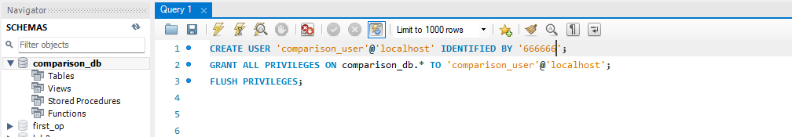

**配置连接参数**：

- **Connection Name**：输入一个易记的连接名称，例如 `Local MySQL`.
- **Hostname**：输入 `localhost`（对于 Docker 容器化时，可以是 `db` 或其他容器内的主机名）。
- **Port**：使用默认的 `3306` 端口。
- **Username**：`root` 。
- **Password**：点击 **“Store in Vault...”**，输入密码666666。
- 

QwEr6666